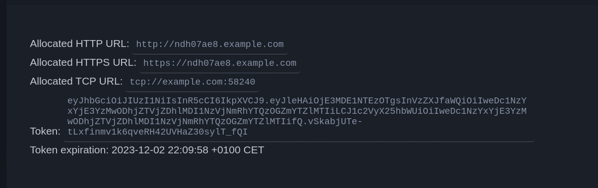

# DeepSquare Web3 Dynamic Reverse Proxy bypassing firewalls

Reverse HTTP/TCP proxy tunnel via SSH connections. Uses Web3 as authenticator.

## Installation

### Static binaries

Prebuilt binaries are available on the [Github Releases](https://github.com/deepsquare-io/proxy/releases) tab.

### Docker

```shell
docker pull ghcr.io/deepsquare-io/proxy-server:latest
```

### Build from source

Build and install from Go:

```shell
# client
go install github.com/deepsquare-io/proxy/cmd/dpsproxy@latest
# server
go install github.com/deepsquare-io/proxy/cmd/dpsproxy-server@latest
```

Manually:

```shell
git clone https://github.com/deepsquare-io/proxy.git
cd proxy
make # outputs are located in the bin/ directory
```

## Usage

### Server

1. Create a `.env` or `.env.local` or set these environment variables:

   ```shell
   ## A 32 bytes hex secret (openssl rand -out - 32 | xxd -p -c 0)
   CSRF_SECRET=cc15bd16819c6c9ab96f161dfab1adcf6ba98ccaf627a0d7de486d713341162c
   ## JWT secret for session tokens
   JWT_SECRET=random
   ## Domain name used for HTTP redirections. (<subdomain>.example.com)
   PUBLIC_DOMAIN=example.com
   ## Contains the SSH host keys
   KEYS_DIR=./

   #SSH_LISTEN_ADDRESS=:2200
   #HTTP_LISTEN_ADDRESS=:3000
   ```

2. Run the binary:

   ```shell
   ./dpsproxy-server
   ```

   The SSH server is running on `2200/tcp` and HTTP on `3000/tcp`.

   You must use reverse proxy to add a SSL layer and forward to `:80` and `:443`. If not, run with the `--insecure` to pass the CSRF token. I recommend to use Caddy as it is easy to use:

   ```Caddyfile
   # /etc/caddy/Caddyfile
   {
     auto_https disable_redirects
   }

   https://*.example.com {
     reverse_proxy localhost:3000

     tls marc.nguyen@deepsquare.io {
       dns googleclouddns { # There is a /etc/caddy/gcp.json
         gcp_project csquare
       }
     }
   }

   http://*.example.com {
     reverse_proxy localhost:3000
   }

   https://example.com {
     reverse_proxy localhost:3000

     tls marc.nguyen@deepsquare.io
   }

   http://example.com {
     reverse_proxy localhost:3000
   }
   ```

### Client

1. Go on the bore proxy web interface `example.com`.

2. Login with MetaMask and generate a route. You can retrieve the route too.

   Expected routes will be shown:

   

   Copy the token. This token will be used for login. Note that the allocation of the route doesn't expires, it is just the authentication token which only have 10 minutes.

   If the token has expired, just "Retrieve Route" again.

3. Assuming:

   - An application is running on `127.0.0.1:3000`
   - The bore proxy is running on `example.com:2200`

   Run the client:

   ```shell
   dpsproxy --reconnect --local.addr 127.0.0.1:300 --to.addr example.com:2200 --secret <token>
   ```

## License

License is [Apache 2](./LICENSE).
